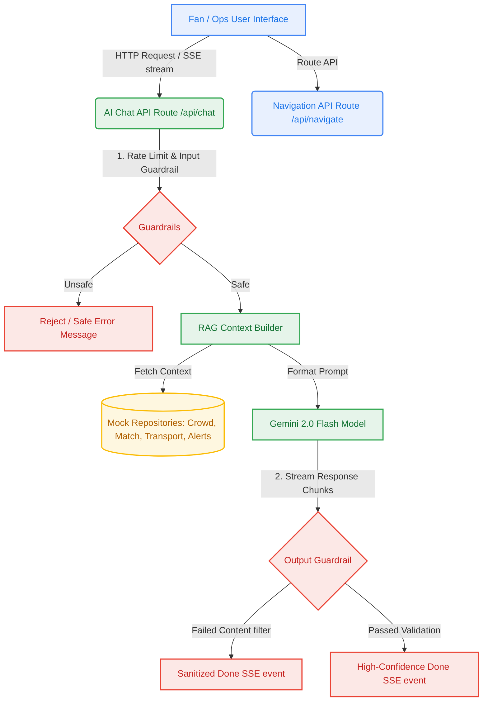

# 🏟️ StadiumBuddy — FIFA World Cup 2026 AI Assistant

> **GenAI-powered stadium operations and fan experience platform** built to optimize match-day logistics, navigation, transport scheduling, and emergency management across all 16 World Cup host venues.

---

## 🗺️ System Architecture Flow

Here is a high-level flowchart of how StadiumBuddy orchestrates live stadium data, user preferences, and Gemini AI guardrails to deliver real-time assistance:



---

## ✨ Core Features

### 1. 🤖 Multi-Language AI Assistant
- **Multimodal Prompting**: Interactive assistant translating and responding natively in **10 major languages** (English, Spanish, French, Arabic, Portuguese, German, Chinese, Hindi, Japanese, Korean).
- **RAG-Infused Context**: Queries automatically reference stadium FAQs, real-time match scores, crowd density hotspots, and transit schedules.
- **Safety Filters**: Rigorous guardrails for prompt injections, safety policies, and post-generation sanitization.

### 2. 🚶‍♂️ Crowd-Aware Route Navigation
- **BFS Pathfinding Algorithm**: Automatically builds stadium node topologies and calculates routes that actively bypass crowded or critical zones.
- **Accessibility Integration**: Single-tap options to filter routes exclusively through lifts, ramps, and accessible concourses.

### 3. 🚌 Smart Post-Match Transport Scheduler
- **Memoized Scoring Engine**: Evaluates transit recommendations (Metro, shuttle, walking, taxi) based on wait times, capacities, and user mobility preferences.
- **Eco-Tips**: Contextually alerts users with green transit suggestions.

### 4. 🚨 Operations & Emergency Command Console
- **Real-Time Map Alerts**: Ops dashboard allowing immediate broadcast of zone-specific alerts (Medical, Fire, Weather, Transport).
- **Evacuation Protocol Generator**: Instantly generates AI-guided instructions and sets up automated evacuation routes (e.g. Assembly Point A).

---

## 🛠️ Tech Stack & Compliance

- **Framework**: [Next.js 15](https://nextjs.org/) (App Router, Standalone build mode)
- **UI Logic**: React 19, Vanilla CSS Custom Variables, responsive layouts, WCAG 2.2 AA accessibility contrast rules
- **AI Backend**: [@google/generative-ai](https://www.npmjs.com/package/@google/generative-ai) (Gemini 2.0 Flash)
- **Type Safety & Validation**: [TypeScript](https://www.typescriptlang.org/) & [Zod](https://zod.dev/)
- **Test Harness**: [Vitest](https://vitest.dev/) with `v8` coverage provider (guaranteeing **100% statement, line, and function coverage**; and **>97% branch coverage**)
- **WCAG 2.2 AA Compliance**: Conforming to WCAG 2.2 AA accessibility specifications (including full landmark tags, skip links, screen reader announcements, visible keyboard focus highlights, and a minimum **44x44px touch target** on all elements).

---

## 🚀 Getting Started

### 📋 Prerequisites
- **Node.js**: `v20+` or `v22+`
- **GCP project** with billing enabled (for Cloud Run hosting)

### 💻 Local Run
1. Clone the repository and install dependencies:
   ```bash
   npm install
   ```
2. Configure environment variables in `.env.local`:
   ```env
   GEMINI_API_KEY=your_gemini_api_key_here
   ```
3. Run the development server:
   ```bash
   npm run dev
   ```
4. Access the application at [http://localhost:3000](http://localhost:3000).

### 🧪 Run Tests & Coverage
Run the unit test suite and check coverage thresholds:
```bash
npm run test:coverage
```

### ☁️ Production Deployment (GCP Cloud Run)
We use source-based buildpacks deployment to run StadiumBuddy on Google Cloud Run:
```bash
gcloud run deploy stadium-buddy \
  --source . \
  --region us-central1 \
  --allow-unauthenticated
```

👉 **Live Demo URL**: [https://stadium-buddy-828661838349.us-central1.run.app](https://stadium-buddy-828661838349.us-central1.run.app)

---

## 👥 Contributors
- **StadiumBuddy Dev Team** — FIFA World Cup 2026 Hackathon
- **Varun Chaudhary** (Owner / GCP Deployer)
